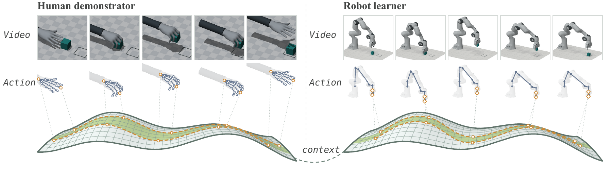
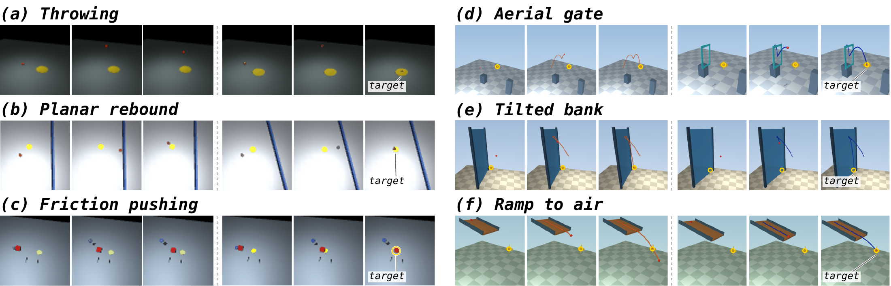
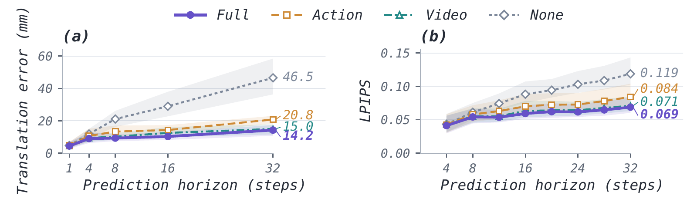
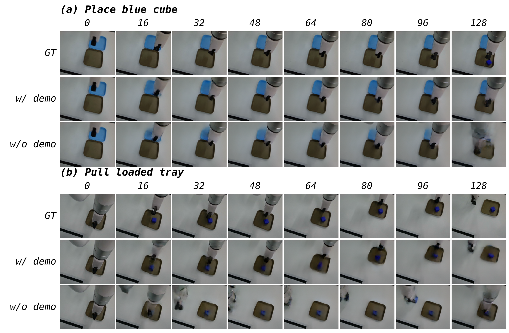
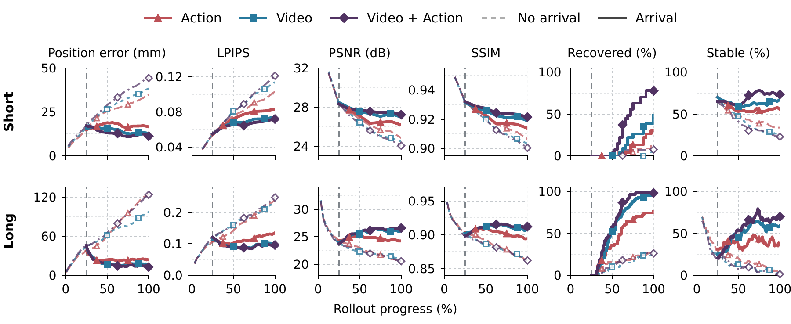
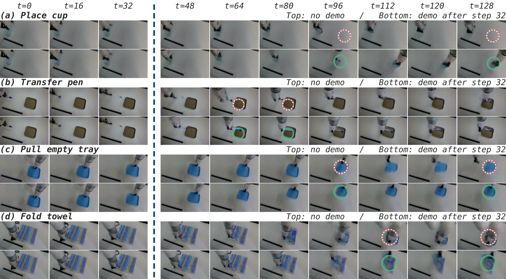

# Video or Action? Demonstration Modality Matters in Embodied In-Context Learning

Code for the paper. Anonymous submission.



*Demonstrator and learner interactions represented as scene video, joint motion,
and keypoint trajectories. MuJoCo illustrations with schematic surfaces, as in
the paper's opening figure.*

## Overview

We study how demonstration video and action trajectories support embodied
in-context learning. A learner uses a demonstration to predict or act under
shared task conditions, while its body, initial state, and response can differ
from those of the demonstrator. Model parameters remain fixed at inference time.

The paper combines a theoretical analysis of cross-embodiment prediction with
controlled policy execution and human–robot future prediction. The analysis
separates insufficient representation capacity from missing task information:
in the studied infinite-context linear-attention model, increasing width cannot
recover information absent from the demonstrator features.

The experiments compare independently trained None, Action, Video, and Full
(Video + Action) models. Separate fixed-weight interventions remove, replace, or
delay demonstrations to test dependence on their content.

## Controlled execution



*Throwing, planar rebound, and friction pushing in 2D; aerial gate, tilted bank,
and ramp-to-air in MuJoCo. Each panel shows three fixed-probe demonstration
frames, followed by three Video-policy execution frames from the first test
record. The dashed line separates demonstration and execution; targets belong
to the learner.*

Fixed probes use preset commands independent of hidden physical parameters.
Video records the resulting object responses and outperforms Action in these
six controls. Adaptive demonstrations instead use commands chosen to reach a
goal under those parameters, allowing the commands to convey information about
the environment. For example, action-only throwing success increases from
29.65% to 99.89% on in-distribution tests. Gains from combining modalities and
performance under held-out learner geometry vary across tasks.

See simulation commands and the
experiment coverage guide for fixed/adaptive protocols and
matched comparisons. The fixed and adaptive 3D tables also differ in supplied
source information and supervision, so their direct comparison does not isolate
the demonstration policy.

## Human–robot prediction

A Transformer with approximately 0.6B trainable parameters predicts 32 future
robot states and video from the current robot observation and aligned human
context. Video is encoded online with a frozen Wan2.2 VAE. Here, Action means
measured human hand trajectories, not robot control commands.

| Demonstration input | ADE ↓ (mm) | FDE ↓ (mm) | LPIPS ↓ |
| --- | ---: | ---: | ---: |
| None | 28.85 | 46.53 | 0.0865 |
| Action | 14.93 | 20.80 | 0.0676 |
| Hand–arm video | 13.05 | 17.20 | 0.0613 |
| Full-scene video | 11.91 | 14.98 | 0.0604 |
| Full-scene video + Action | **10.61** | **14.24** | **0.0582** |

*Means on the paper's 50 matched test windows, with independently trained models
and paired generation noise. All models retain the current robot image and
state. ADE averages position error over the prediction; FDE measures the final
step. These are prediction metrics, not robot execution success rates.*



*Prediction errors over 32 future steps. Lines show means; bands are pointwise
95% confidence intervals from resampling instruction groups. Demonstration
context has a larger effect farther into the continuation.*

### Predicted robot video



*Cube placement and tray pulling over 128 steps. GT shows recorded robot frames;
w/ demo and w/o demo are decoded predictions from the same fixed-weight model,
with both demonstration modalities present or masked. The examples illustrate
changes in object placement and prediction drift; blur and artifacts remain.*

### Late-arriving demonstrations



*Action, Video, and Full are independently trained predictors. Each solid curve
supplies that predictor's trained demonstration modality after step 8 of 32
(short) or step 32 of 128 (long); its dashed counterpart never receives the
demonstration. Each pair uses the same weights and generation noise. Curves
summarize 83 windows from 42 episodes.*

Prediction continues from the model's own frame and state, without a ground-truth
reset. Recovery requires eight consecutive steps within 20 mm after the position
error exceeds that threshold at arrival. Stability applies the same threshold
to the latest eight steps. These quantities describe prediction recovery, not
physical task completion.



*Cup placement, pen transfer, tray pulling, and towel folding. In each pair, the
top row never receives a demonstration; the bottom row receives both modalities
after step 32, marked by the divider. Paired rows share the same predicted prefix
and noise. Circles highlight selected differences in the decoded continuations.*

Incorrect demonstrations also increase prediction error more than removing
context. See human–robot prediction and
context interventions for implementation and commands.

## Installation

Use Python 3.10 or newer with a PyTorch build appropriate for your device.

```bash
python -m venv .venv
source .venv/bin/activate
python -m pip install -e '.[simulation,test]'

# CPU example with synthetic latent inputs; no pretrained weights required.
python scripts/smoke_model.py
python -m pytest -q
```

Training requires CUDA. Simulator rendering requires a supported OpenGL backend.
On macOS, set `MUJOCO_GL=glfw` and use `mjpython` where required by MuJoCo.

## Repository

| Component | Location |
| --- | --- |
| Human–robot model and training | `src/fasterwam/`, `scripts/` |
| Modality, coupling, and context ablations | `protocols/` |
| 2D tasks and adaptive demonstrations | `experiments/` |
| 3D tasks and geometry shifts | `experiments/spatial/`, `experiments/spatial_fixed/`, `experiments/spatial_paired/`, `experiments/adaptive_spatial/` |
| Representation-width experiments | `experiments/theory/` |

## Data and checkpoints

The release includes core models, synthetic data generators, and training and
evaluation code. Private human–robot recordings and trained checkpoints are not
included. Coverage and required assets describes what can be
run from this release and what requires additional data.

License · Third-party notices ·
Release verification
